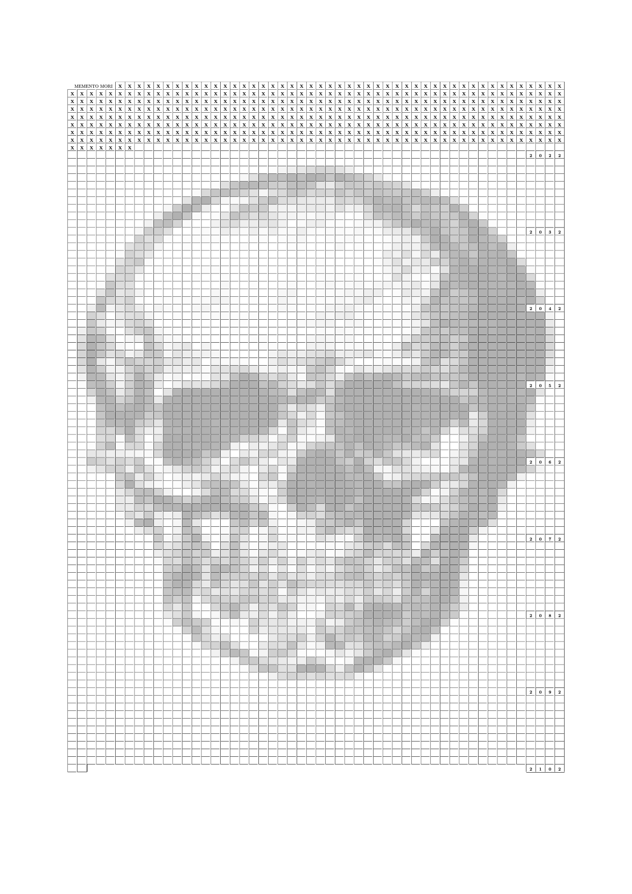

# Introduction

One day you will die.
It's worth keeping in mind.
This project will generate an A4-sized sheet of paper with a grid containing one square for every week of your expected life (which defaults to 78 years).
If you provide your birthdate, it will `x` out the ones that have passed and are therefore only part of your fading memory.

# Usage

The script generates a LaTeX file:

    ./memento.py > page.tex

You can tell it how many years to generate (default: 78) and have it `x` off the weeks you've lived if you provide a birthdate:

    ./memento.py -y 84 -b 1980-07-04 > page.tex

To use an image as the background, use the `--background` and `--opacity` flags:

    ./memento.py --background examples/skull.jpg --opacity 0.2 -b 1980-07-04 -y 90 > page.tex

Good opacity values are likely 0.1—0.3, though it will of course depend on what image you are using.

If you prefer, you can use `--watermark` instead, which will put an image behind the table (opacity doesn't work with this option).

Compile with `pdflatex`:

    pdflatex page.tex

This will produce a file, `page.pdf`, which you can print out and hang somewhere prominent.
